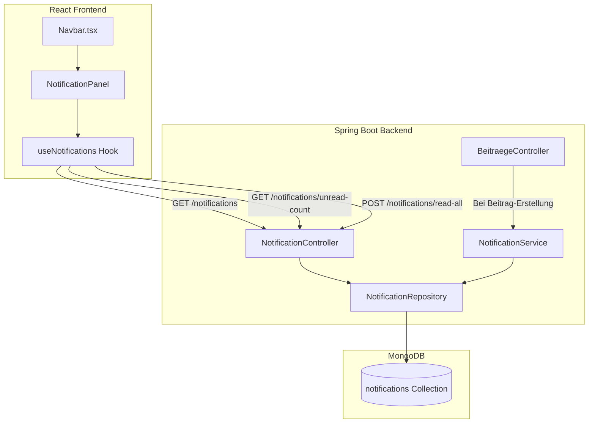

# Design Document: Notification List

## Overview

Dieses Design beschreibt die Implementierung einer persistenten Benachrichtigungsliste für die Social-App. Aktuell werden Benachrichtigungen nur als Web-Push versendet (via `PushNotificationService`), ohne sie in der Datenbank zu speichern. Das neue Feature ergänzt eine MongoDB-Collection `notifications`, einen REST-API-Layer und ein Frontend-Panel, das beim Klick auf das Glocken-Icon eine chronologische Liste der Benachrichtigungen anzeigt.

### Kernziele
- Benachrichtigungen persistent in MongoDB speichern (parallel zum bestehenden Web-Push)
- REST-API für Abruf, Ungelesen-Zähler und Gelesen-Markierung
- Frontend-Integration: Badge mit Echtzeit-Zähler und Dropdown-Panel via MUI Popover

### Abgrenzung
- Push-Benachrichtigungen (Web Push API) bleiben unverändert bestehen
- Keine Echtzeit-Updates via WebSocket – Polling beim Laden der Navbar reicht vorerst
- Keine einzelne Notification als gelesen markierbar – nur "Alle als gelesen markieren"

---

## Architecture



### Datenfluss bei Beitrag-Erstellung

1. `BeitraegeController.uploadBeitrag()` speichert den Beitrag
2. `BeitraegeController` ruft `NotificationService.createNotifications(beitrag, recipients)` auf
3. `NotificationService` erstellt für jeden Empfänger (exklusive Autor) ein `Notification`-Dokument und speichert es via `NotificationRepository`
4. Der bestehende `PushNotificationService.sendToPersons()` bleibt unverändert aktiv (Web Push parallel)

### Datenfluss bei Notification-Abruf

1. Frontend ruft `GET /notifications/unread-count` beim Laden der Navbar auf
2. Badge zeigt Zähler an (0 = unsichtbar, >99 = "99+")
3. Bei Klick auf Glocke: `GET /notifications?page=0&size=50`
4. Panel zeigt Notifications an; bei Öffnung: `POST /notifications/read-all`
5. Badge wird auf 0 zurückgesetzt

---

## Components and Interfaces

### Backend-Komponenten

#### NotificationService

```java
@Service
public class NotificationService {

    @Autowired
    private NotificationRepository notificationRepository;

    @Autowired
    private PersonRepository personRepository;

    /**
     * Erstellt Notifications für alle Empfänger eines neuen Beitrags.
     * Der Autor selbst erhält keine Notification.
     */
    @Async
    public void createNotifications(Beitrag beitrag, List<Person> recipients) { ... }
}
```

- **Verantwortung:** Notification-Dokumente erstellen und in die DB schreiben
- **Fehlerbehandlung:** Fehler pro Empfänger loggen, verbleibende Empfänger weiter verarbeiten
- **Aufruf:** Wird aus `BeitraegeController.uploadBeitrag()` aufgerufen (nach dem Speichern des Beitrags)

#### NotificationController

```java
@RestController
@RequestMapping("/notifications")
public class NotificationController {

    @GetMapping
    public Page<Notification> getNotifications(
        @RequestParam(defaultValue = "0") int page,
        @RequestParam(defaultValue = "20") int size) { ... }

    @GetMapping("/unread-count")
    public long getUnreadCount() { ... }

    @PostMapping("/read-all")
    public ResponseEntity<Void> markAllAsRead() { ... }
}
```

- **Authentifizierung:** Nutzt `UserInfo.getPerson()` für die Person-ID (identisch zum bestehenden Pattern)
- **Autorisierung:** Gibt ausschließlich Notifications des authentifizierten Benutzers zurück
- **Paginierung:** `page` (Standard: 0), `size` (Standard: 20, Maximum: 100)

#### NotificationRepository

```java
public interface NotificationRepository extends MongoRepository<Notification, String> {
    Page<Notification> findByRecipientIdOrderByCreatedAtDesc(String recipientId, Pageable pageable);
    long countByRecipientIdAndReadFalse(String recipientId);
    @Update("{ '$set': { 'read': true } }")
    long updateByRecipientIdAndReadFalse(String recipientId);
}
```

### Frontend-Komponenten

#### useNotifications Hook

```typescript
interface UseNotificationsReturn {
  notifications: Notification[];
  unreadCount: number;
  loading: boolean;
  error: string | null;
  fetchNotifications: () => Promise<void>;
  fetchUnreadCount: () => Promise<void>;
  markAllAsRead: () => Promise<void>;
}

function useNotifications(token: string | null): UseNotificationsReturn;
```

- **Verantwortung:** API-Kommunikation, State-Management, Fehlerbehandlung
- **Initialer Abruf:** `unreadCount` beim Mount (für Badge)
- **On-Demand:** `notifications` beim Öffnen des Panels

#### NotificationPanel

```typescript
interface NotificationPanelProps {
  anchorEl: HTMLElement | null;
  open: boolean;
  onClose: () => void;
  token: string | null;
}

function NotificationPanel(props: NotificationPanelProps): JSX.Element;
```

- **UI:** MUI `Popover` mit einer Liste von `NotificationItem`-Elementen
- **Verhalten:** Beim Öffnen → Notifications laden → alle als gelesen markieren
- **Leer-Zustand:** Hinweistext "Keine Benachrichtigungen vorhanden"
- **Fehler-Zustand:** Fehlermeldung anzeigen, vorherige Daten beibehalten

---

## Data Models

### Backend: Notification Document (MongoDB)

```java
@Document(collection = "notifications")
@Getter
@Setter
public class Notification {
    @MongoId(FieldType.OBJECT_ID)
    private String id;

    @Field
    @Indexed
    private String recipientId;    // Person.id des Empfängers

    @Field
    private String senderName;     // Name des Beitrag-Autors

    @Field
    private String beitragTitel;   // Maximal 200 Zeichen

    @Field
    private String beitragId;      // Referenz auf den Beitrag

    @Field
    @Indexed
    private Instant createdAt;     // UTC-Zeitstempel

    @Field
    private boolean read;          // Initialer Wert: false
}
```

**Indizes:**
- `recipientId` (für alle Abfragen nach Benutzer)
- `createdAt` (für absteigende Sortierung)
- Compound Index: `{ recipientId: 1, read: 1 }` (für unread-count Abfrage)

### Frontend: Notification Type

```typescript
// src/datenformat/Notification.ts
export interface Notification {
  id: string;
  senderName: string;
  beitragTitel: string;
  beitragId: string;
  createdAt: string;    // ISO-8601 UTC String vom Backend
  read: boolean;
}
```

### API-Responses

**GET /notifications** (Paginated)
```json
{
  "content": [
    {
      "id": "665a...",
      "senderName": "Max Mustermann",
      "beitragTitel": "Neuer Beitrag über...",
      "beitragId": "665b...",
      "createdAt": "2026-07-25T14:32:00Z",
      "read": false
    }
  ],
  "totalElements": 42,
  "totalPages": 3,
  "number": 0,
  "size": 20
}
```

**GET /notifications/unread-count**
```json
{ "count": 5 }
```

**POST /notifications/read-all**
```
HTTP 200 OK (leerer Body)
```

---

## Correctness Properties

*A property is a characteristic or behavior that should hold true across all valid executions of a system — essentially, a formal statement about what the system should do. Properties serve as the bridge between human-readable specifications and machine-verifiable correctness guarantees.*

### Property 1: Notification-Erstellung exkludiert den Autor

*For any* Beitrag mit einem Autor und einer beliebigen Empfänger-Liste (leer oder nicht-leer), soll das Erstellen von Notifications niemals eine Notification erzeugen, deren `recipientId` mit der Person-ID des Autors übereinstimmt.

**Validates: Requirements 1.1, 1.2**

### Property 2: Notification enthält alle Pflichtfelder

*For any* erzeugte Notification soll das Dokument alle Pflichtfelder enthalten: eine nicht-leere ID, eine gültige recipientId, einen nicht-leeren senderName, einen beitragTitel (≤ 200 Zeichen), eine nicht-leere beitragId, einen gültigen createdAt-Zeitstempel und einen initialen read-Wert von `false`.

**Validates: Requirements 1.3, 1.4**

### Property 3: Notifications werden nur für den authentifizierten Benutzer zurückgegeben

*For any* Abfrage an `GET /notifications` mit einem authentifizierten Benutzer sollen alle zurückgegebenen Notifications eine `recipientId` haben, die exakt der Person-ID des anfragenden Benutzers entspricht.

**Validates: Requirements 2.2, 2.5**

### Property 4: Notifications sind absteigend nach Zeitstempel sortiert

*For any* Ergebnisliste von `GET /notifications` soll der Zeitstempel jeder Notification kleiner oder gleich dem Zeitstempel der vorherigen Notification sein (absteigende Reihenfolge).

**Validates: Requirements 2.1**

### Property 5: Unread-Count stimmt mit tatsächlich ungelesenen Notifications überein

*For any* Benutzer soll der von `GET /notifications/unread-count` zurückgegebene Wert exakt der Anzahl der Notifications in der Datenbank entsprechen, deren `recipientId` dem Benutzer gehört und deren `read`-Feld `false` ist.

**Validates: Requirements 2.3**

### Property 6: Mark-All-As-Read setzt alle ungelesenen Notifications auf gelesen

*For any* Benutzer mit N ungelesenen Notifications, nach Aufruf von `POST /notifications/read-all`, soll die Anzahl ungelesener Notifications dieses Benutzers 0 sein, und alle zuvor ungelesenen Notifications sollen `read=true` haben.

**Validates: Requirements 3.1, 3.2**

### Property 7: Mark-All-As-Read ist idempotent

*For any* Benutzer ohne ungelesene Notifications soll der Aufruf von `POST /notifications/read-all` eine Erfolgsantwort zurückgeben und keine Daten verändern.

**Validates: Requirements 3.3**

### Property 8: Badge-Anzeige folgt dem Ungelesen-Zähler

*For any* Ungelesen-Zähler `n`: wenn `n == 0` wird kein Badge angezeigt; wenn `0 < n ≤ 99` wird die exakte Zahl angezeigt; wenn `n > 99` wird "99+" angezeigt.

**Validates: Requirements 4.2, 4.3, 4.4**

### Property 9: Zeitstempel-Formatierung Roundtrip

*For any* gültiger UTC-Zeitstempel (ISO-8601), soll die Konvertierung in die lokale Zeitzone und die Formatierung im Muster "TT.MM.JJJJ, HH:MM Uhr" ein valides Ergebnis mit zweistelligem Tag (01–31), zweistelligem Monat (01–12), vierstelligem Jahr und 24-Stunden-Zeit (00:00–23:59) produzieren.

**Validates: Requirements 6.1, 6.2, 6.4**

### Property 10: Ungültige Zeitstempel zeigen Platzhalter

*For any* Notification mit ungültigem Zeitstempel (null, undefined oder nicht-parsbarer String), soll die Anzeige den Platzhaltertext "—" zeigen.

**Validates: Requirements 6.3**

---

## Error Handling

### Backend

| Szenario | Verhalten |
|----------|-----------|
| DB-Fehler beim Speichern einer einzelnen Notification | Fehler loggen (WARN), nächsten Empfänger verarbeiten |
| DB-Fehler bei `GET /notifications` | HTTP 500 mit Fehlermeldung |
| DB-Fehler bei `POST /notifications/read-all` | HTTP 500 mit Fehlermeldung, keine Notifications verändert |
| Nicht-authentifizierter Request | HTTP 401 (durch Spring Security automatisch) |
| `size` > 100 bei Paginierung | Auf Maximum 100 begrenzen |
| `beitragTitel` > 200 Zeichen | Auf 200 Zeichen abschneiden bei der Erstellung |

### Frontend

| Szenario | Verhalten |
|----------|-----------|
| API-Fehler beim Laden des Ungelesen-Zählers | Badge ausblenden, keinen Zähler zeigen |
| API-Fehler beim Laden der Notifications | Fehlermeldung im Panel, vorherige Daten beibehalten |
| API-Fehler bei Mark-All-As-Read | Fehlermeldung im Panel, Badge bleibt unverändert |
| Ungültiger Zeitstempel in Notification | Platzhalter "—" anzeigen |
| Leerer senderName oder beitragTitel | Abgeschnittener Text mit "…" bzw. Fallback auf leeren String |

---

## Testing Strategy

### Property-Based Tests (Backend – Java mit jqwik)

Die folgenden Correctness Properties werden als Property-Based Tests implementiert:

- **Property 1–2:** NotificationService-Logik (Autor-Ausschluss, Pflichtfelder)
- **Property 3–5:** NotificationController/Repository-Logik (Benutzer-Isolation, Sortierung, Zähler-Konsistenz)
- **Property 6–7:** Mark-All-As-Read-Logik (Zustandsänderung, Idempotenz)

### Property-Based Tests (Frontend – fast-check)

- **Property 8:** Badge-Anzeige-Logik als reine Funktion testbar
- **Property 9–10:** Zeitstempel-Formatierungsfunktion

### Konfiguration

- **Backend:** jqwik mit mindestens 100 Iterationen pro Property-Test
- **Frontend:** fast-check mit mindestens 100 Iterationen pro Property-Test
- **Tag-Format:** `Feature: notification-list, Property {number}: {Beschreibung}`

### Unit Tests

- `NotificationController`: Paginierung, 401-Antwort ohne Auth, size-Begrenzung auf 100
- `NotificationPanel`: Render-Tests (Leer-Zustand, Fehler-Zustand, Notification-Darstellung)
- `useNotifications`: Hook-Tests mit gemockter API (Lade-/Fehler-Zustände)

### Integration Tests

- Vollständiger Flow: Beitrag erstellen → Notifications prüfen → Abrufen → Als gelesen markieren
- MongoDB-Testcontainer für Backend-Integrationstests
