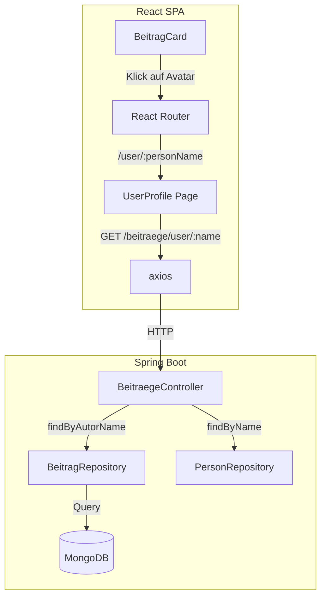
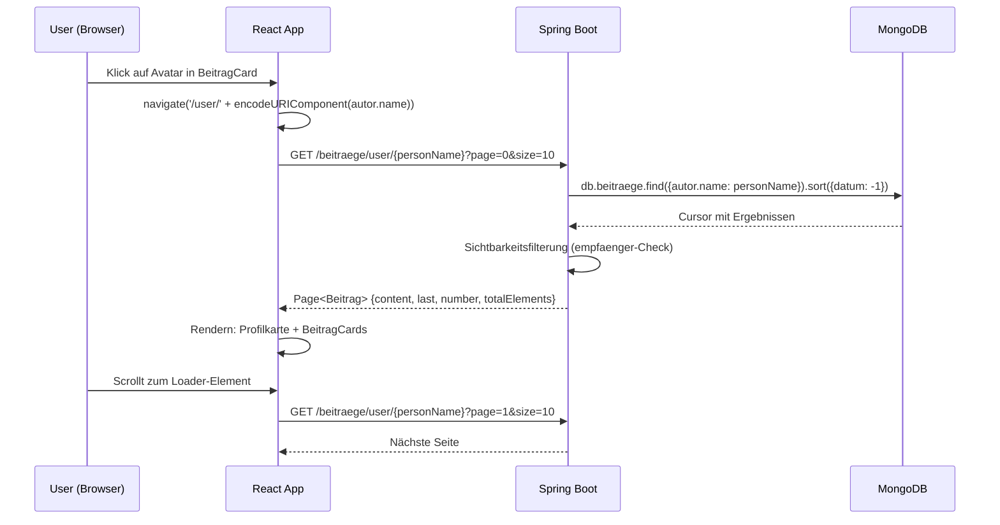

# Design Document: Profile Navigation

## Overview

Dieses Feature ermöglicht es Nutzern, über den Avatar in einem BeitragCard zum Profil des jeweiligen Autors zu navigieren. Es umfasst drei Kernbestandteile:

1. **Klickbarer Avatar** – Der Avatar im `CardHeader` der `BeitragCard` wird zu einem anklickbaren Link, der zur öffentlichen Profilseite des Autors navigiert.
2. **Öffentliche Profilseite** (`/user/:personName`) – Eine neue Seitenkomponente, die Avatar, Name und paginierte Beiträge eines Nutzers im Liquid-Glass-Design darstellt.
3. **Backend-Endpoint** (`GET /beitraege/user/{personName}`) – Ein neuer REST-Endpoint, der Beiträge eines bestimmten Autors mit Sichtbarkeitsfilterung und Pagination zurückgibt.

Die Umsetzung folgt den bestehenden Architekturmustern: React-Router für Navigation, `axios` für API-Calls, `IntersectionObserver` für Infinite-Scrolling, und Spring Data MongoDB für die Backend-Queries.

## Architecture



### Entscheidungen

| Entscheidung | Begründung |
|---|---|
| `personName` als URL-Parameter (statt `id`) | Nutzerfreundliche URLs (`/user/Lukas`), konsistent mit bestehender `Person.name` als unique Index |
| Wiederverwendung von `BeitragCard` auf der Profilseite | Vermeidet Duplizierung, konsistentes Erscheinungsbild |
| Sichtbarkeitsfilterung im Backend | Sicherheit: Frontend darf keine geschützten Beiträge erhalten |
| Separate Route `/user/:personName` statt Erweiterung von `/profile` | Klare Trennung zwischen eigenem Profil (Einstellungen) und öffentlicher Profilansicht |
| `IntersectionObserver` für Pagination | Gleicher Ansatz wie im bestehenden Feed (`/secure`) |

## Components and Interfaces

### Frontend-Komponenten

#### 1. `UserProfile` (neue Komponente)

Neue Seitenkomponente unter `src/UserProfile.tsx`.

```typescript
// Props: keine (personName kommt aus URL-Parameter)
// Route: /user/:personName

interface UserProfileState {
  person: Person | null;        // Profildaten des angezeigten Nutzers
  beitraege: Beitrag[];         // Geladene Beiträge
  page: number;                 // Aktuelle Seite
  hasMore: boolean;             // Weitere Seiten verfügbar?
  loading: boolean;             // Ladevorgang aktiv?
  error: string | null;         // Fehlermeldung
  personNotFound: boolean;      // Nutzer nicht gefunden?
}
```

Verantwortlichkeiten:
- Profildaten (Person) vom bestehenden `/users`-Endpoint oder `PersonRepository` laden
- Beiträge über `GET /beitraege/user/{personName}` paginiert laden
- Infinite-Scrolling via `IntersectionObserver` (analog zu `App.tsx`)
- Fehler- und Leer-Zustände behandeln
- Liquid-Glass-Design für die Profilkarte

#### 2. `BeitragCard` (Erweiterung)

Minimale Änderung: Avatar im `CardHeader` wird klickbar.

```typescript
// Neue Logik im bestehenden BeitragCard:
// - Avatar mit onClick-Handler wrappen
// - Navigiert zu /user/{autor.name} via useNavigate()
// - Nur wenn: bearbeiten === false UND autor vorhanden UND autor.name nicht leer
// - cursor: pointer Style auf dem Avatar
```

#### 3. `App.tsx` (Route-Erweiterung)

```typescript
// Neue Route hinzufügen:
<Route path="/user/:personName" element={<UserProfile token={token} user={user} />} />
```

### Backend-Interfaces

#### `BeitraegeController` (Erweiterung)

```java
@GetMapping("/beitraege/user/{personName}")
public Page<Beitrag> beitraegeByUser(
    @PathVariable String personName,
    @RequestParam(defaultValue = "0") int page,
    @RequestParam(defaultValue = "10") int size
) { ... }
```

#### `BeitragRepository` (Erweiterung)

```java
Page<Beitrag> findByAutor_NameOrderByDatumDesc(String name, Pageable pageable);
```

Spring Data MongoDB leitet aus dem Methodennamen die passende Query ab: Filterung auf `autor.name` mit Sortierung nach `datum` absteigend.

## Data Models

### Bestehende Modelle (unverändert)

**`Person`** (Backend):
```java
@Document(collection = "person")
public class Person {
    @Id String id;
    @Indexed(unique = true) String name;
    @Indexed(unique = true, sparse = true) String sub;
    String avatar_url;
    List<PushSubscription> pushSubscriptions;
}
```

**`Person`** (Frontend):
```typescript
export class Person {
    name!: string;
    avatar_url?: string;
}
```

**`Beitrag`** (Backend):
```java
@Document(collection = "beitraege")
public class Beitrag {
    @MongoId String id;
    String link, titel, beschreibung;
    Date datum;
    Person autor;
    List<Person> empfaenger;
    Integer gefaellt_num, gefaellt_nicht_num, angesehen_num;
    List<Person> gefaellt, gefaelltNicht, angesehen;
}
```

### Datenfluss



### API-Response-Format

Der Endpoint gibt dasselbe `Page<Beitrag>`-Format zurück wie der bestehende `/beitraege`-Endpoint:

```json
{
  "content": [{ "id": "...", "titel": "...", "autor": {"name": "Lukas", "avatar_url": "..."}, ... }],
  "last": false,
  "number": 0,
  "totalPages": 3,
  "totalElements": 25
}
```

## Correctness Properties

*A property is a characteristic or behavior that should hold true across all valid executions of a system — essentially, a formal statement about what the system should do. Properties serve as the bridge between human-readable specifications and machine-verifiable correctness guarantees.*

### Property 1: Author-Filterung

*For any* Menge von Beiträgen in der Datenbank und *for any* gültigem `personName`, soll der Endpoint `GET /beitraege/user/{personName}` ausschließlich Beiträge zurückgeben, deren `autor.name` exakt (case-sensitive) dem angegebenen `personName` entspricht, und diese nach `datum` absteigend sortiert sein.

**Validates: Requirements 3.1**

### Property 2: Sichtbarkeitsfilterung

*For any* authentifizierten Nutzer und *for any* Menge von Beiträgen, soll der Endpoint `GET /beitraege/user/{personName}` nur Beiträge zurückgeben, für die gilt: die `empfaenger`-Liste ist leer/null (öffentlicher Beitrag) ODER der anfragende Nutzer ist der Autor ODER der Name des anfragenden Nutzers ist in der `empfaenger`-Liste enthalten.

**Validates: Requirements 3.2**

## Error Handling

### Frontend

| Szenario | Verhalten |
|---|---|
| `personName` nicht in DB gefunden | Fehlermeldung "Nutzer nicht gefunden" + Zurück-Button zum Feed |
| Netzwerkfehler beim Laden der Profildaten | Fehlermeldung + "Erneut versuchen"-Button, der den Fetch wiederholt |
| Netzwerkfehler beim Nachladen einer Seite | Fehlermeldung am Ende der Liste, bereits geladene Beiträge bleiben erhalten |
| `autor` im Beitrag ist `null` oder `autor.name` ist leer | Avatar wird ohne Klick-Interaktion gerendert (kein `onClick`, kein `cursor: pointer`) |
| 401-Response vom Backend | Bestehender axios-Interceptor greift → Redirect zum Login |

### Backend

| Szenario | Verhalten |
|---|---|
| `personName` existiert nicht in `person`-Collection | Leere Page zurückgeben (`content: []`, `totalElements: 0`) — kein 404, da es valide ist, dass ein Nutzer keine Beiträge hat |
| `size` > 50 | Wird auf 50 gekappt |
| `page` < 0 | Spring Data fängt dies ab (Standard-Verhalten: IllegalArgumentException → 400) |
| Nicht authentifiziert | Bestehender Security-Filter greift → 401 |

### Design-Entscheidung: Kein 404 bei unbekanntem Nutzer im Backend

Der Endpoint gibt eine leere Seite zurück statt 404, da:
- Die Profilseite im Frontend den Nutzer separat über den bestehenden `/users`-Endpoint oder einen neuen Lookup-Mechanismus prüfen kann
- Es vereinfacht die Backend-Logik (keine Unterscheidung zwischen "Nutzer existiert, hat aber keine Beiträge" und "Nutzer existiert nicht")
- Alternativ könnte ein `GET /user/{personName}`-Endpoint hinzugefügt werden, der die Person-Daten liefert und 404 zurückgibt, wenn der Nutzer nicht existiert — dies ist für die Profilkarte (Avatar + Name) ohnehin nötig

**Zusätzlicher Endpoint für Person-Lookup:**

```java
@GetMapping("/user/{personName}")
public ResponseEntity<Person> getUserByName(@PathVariable String personName) {
    Person person = personRepository.findByName(personName);
    if (person == null) {
        return ResponseEntity.notFound().build();
    }
    return ResponseEntity.ok(person);
}
```

Das Frontend ruft zuerst `/user/{personName}` auf, um die Profildaten zu erhalten. Bei 404 wird die "Nutzer nicht gefunden"-Meldung angezeigt. Die Beiträge werden erst bei erfolgreichem Person-Lookup geladen.

## Testing Strategy

### Unit Tests (Frontend)

- **BeitragCard-Avatar-Klick**: Avatar klickbar wenn `bearbeiten=false` und `autor.name` vorhanden; nicht klickbar wenn `bearbeiten=true` oder `autor.name` leer
- **UserProfile-Rendering**: Profilkarte zeigt Avatar + Name; Loading-Spinner während Fetch; Fehlermeldung bei 404; Leer-Zustand bei 0 Beiträgen
- **UserProfile-Pagination**: Infinite-Scroll löst nächste Seite aus; stoppt bei `last=true`; bewahrt existierende Beiträge bei Fehler

### Unit Tests (Backend)

- **BeitraegeController**: Endpoint liefert nur Beiträge des angegebenen Autors; Sichtbarkeitsfilterung korrekt; `size`-Capping auf 50; leere Page bei unbekanntem Nutzer
- **Person-Lookup-Endpoint**: 200 mit Person-Daten bei existierendem Namen; 404 bei unbekanntem Namen

### Property-Based Tests (Backend)

Die Correctness Properties 1 und 2 werden als Property-Based Tests mit **jqwik** (Java PBT-Bibliothek für JUnit 5) implementiert:

- **Bibliothek**: `net.jqwik:jqwik:1.9.x`
- **Minimum 100 Iterationen** pro Property-Test
- **Tag-Format**: `Feature: profile-navigation, Property {number}: {property_text}`

Jeder Property-Test:
1. Generiert zufällige Mengen von `Beitrag`-Objekten mit variierenden `autor.name`- und `empfaenger`-Werten
2. Speichert diese in einer eingebetteten MongoDB (oder Testcontainers)
3. Ruft den Endpoint auf
4. Verifiziert die entsprechende Property (alle Ergebnisse haben korrekten Autor + Sortierung bzw. Sichtbarkeitsregel)

### Integrationstests

- End-to-End-Flow: Avatar-Klick → Navigation → Profilseite lädt Daten → Beiträge werden angezeigt
- Pagination: Mehrere Seiten werden korrekt nachgeladen
- Fehlerfall: Backend nicht erreichbar → Fehlermeldung im Frontend
